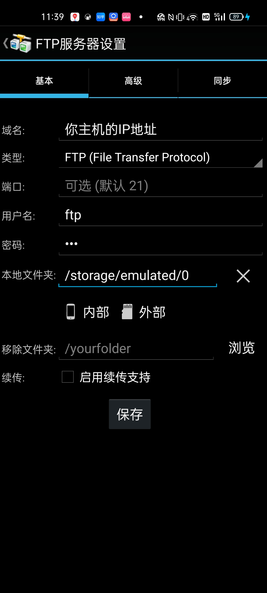
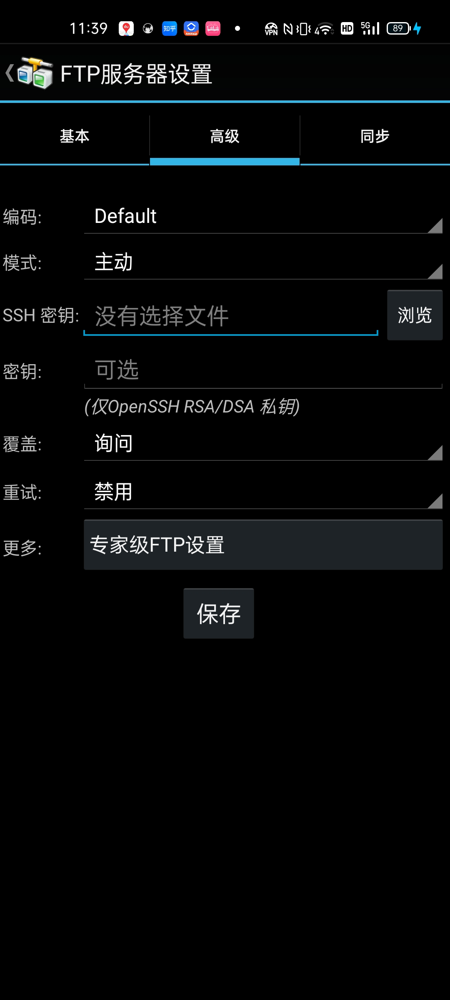
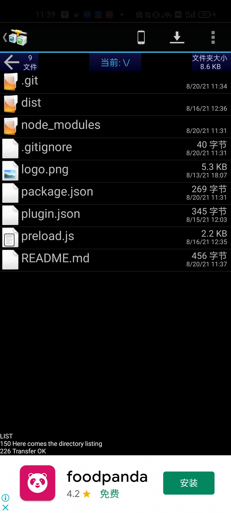
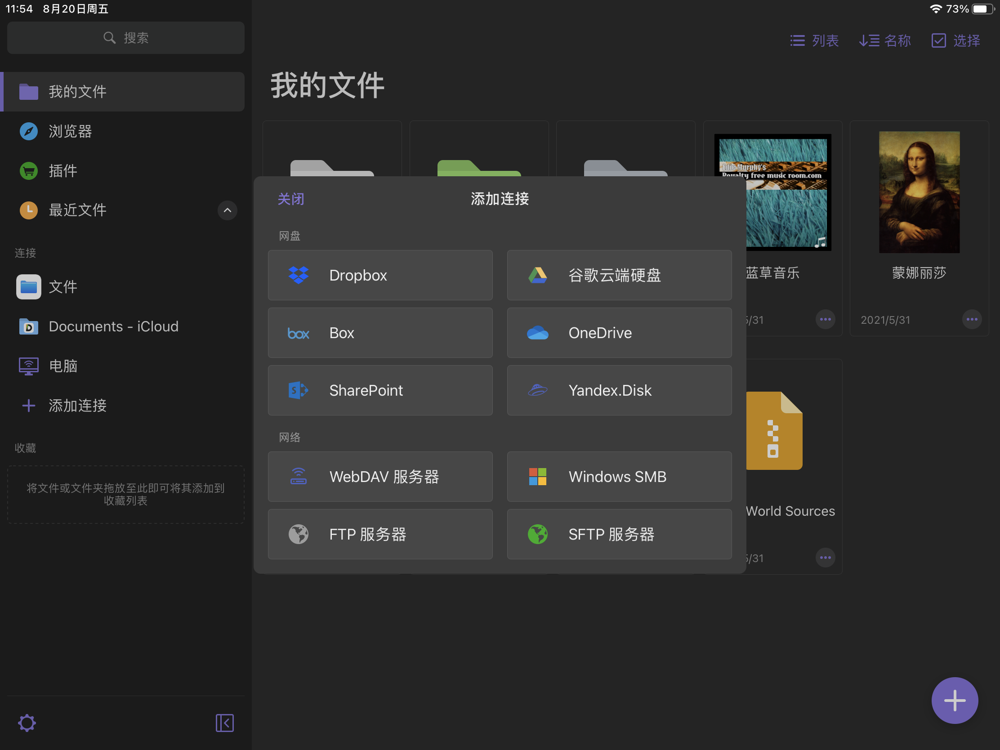
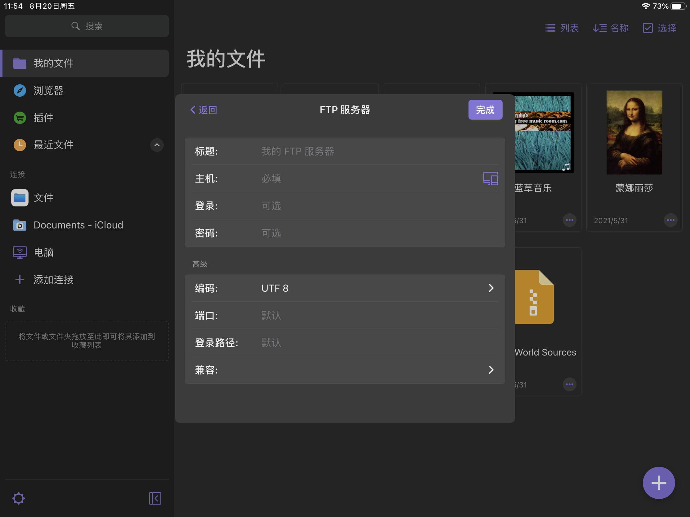
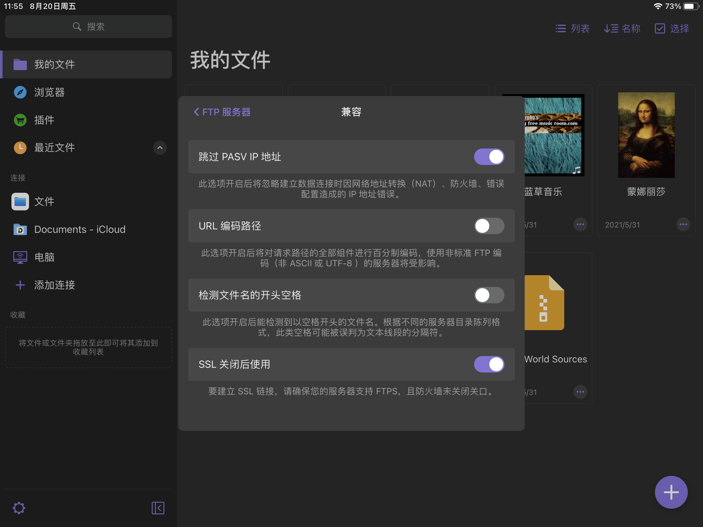
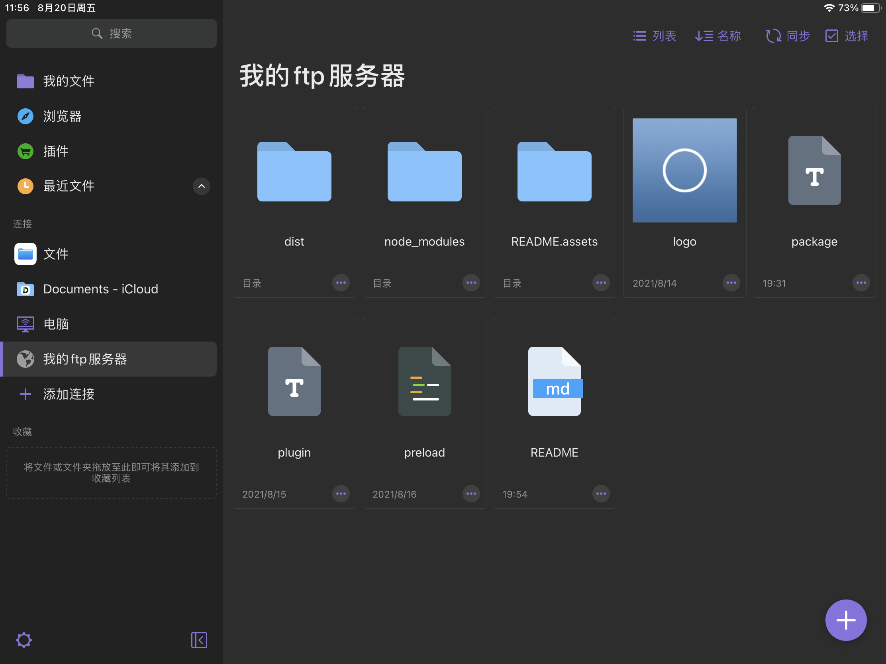

# utools-ftpd

在特定文件夹启动FTP服务器，以实现PC和移动端的数据传输。

默认用户名密码皆为`ftp`.

<!-- TODO: 服务器启动期间仍可以修改设置。 -->
<!-- TODO: 界面黑暗模式 -->

## 如何连接FTP

本部分适用于第一次使用FTP客户端的人群。

使用FTP需要你的客户端与PC在同一个局域网内，且客户端能访问到主机。

### 安卓手机

推荐使用「AndFTP」。需要填写你主机的IP地址、用户名和端口。

有的软件还需要设置传输模式为「主动」。

连接完成后如图。

### iOS手机

推荐使用「Documents by Readdle」。

点击左侧「添加连接」，选择「FTP服务器」。

输入主机、登录用户名、密码。

需要点击上图的「兼容」，并打开「跳过PASV IP地址」。

完成后效果如下图。

## 版本说明

> v1.0.0

只简单完成了代码。后期还应当：

1. 提供配置界面
2. 更好的选择文件夹方式

> v1.0.1

1. 添加在启动和退出时的showNotification
2. 添加运行后自动隐藏窗口和outPlugin
3. 设置默认用户为ftp。

> v1.0.2

添加描述和使用说明。
